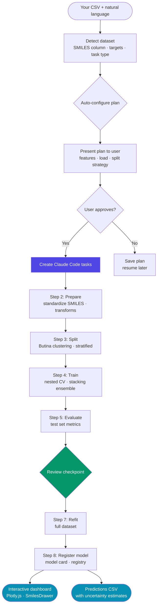
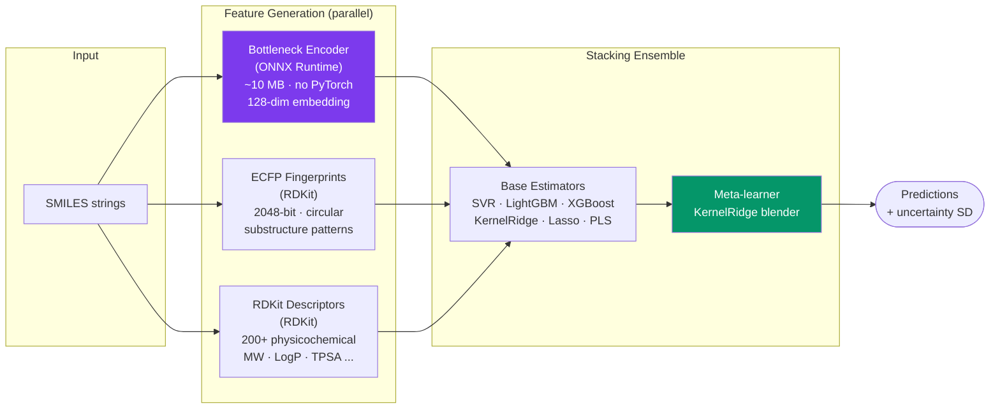
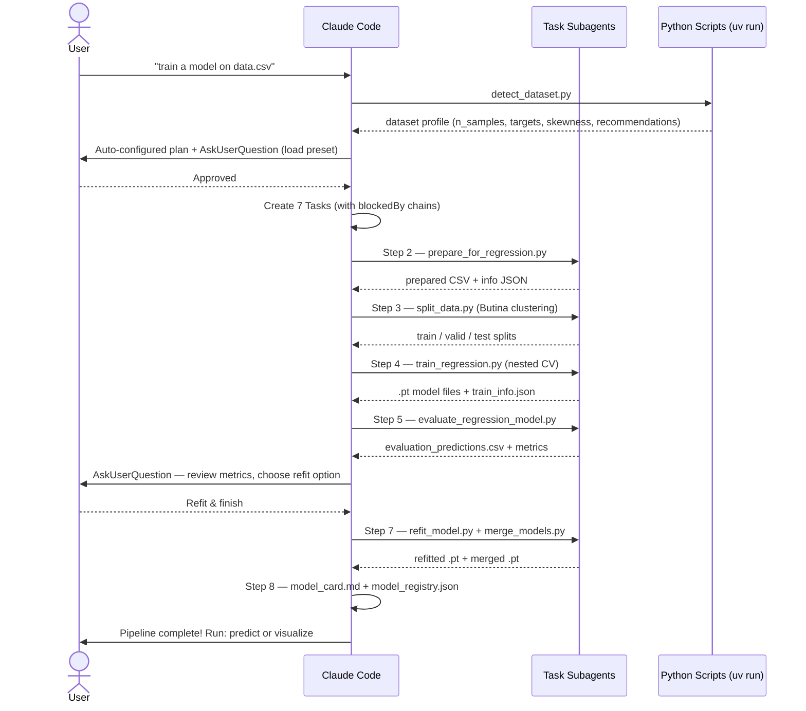
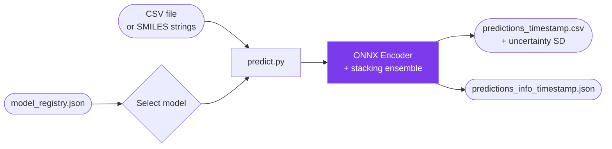
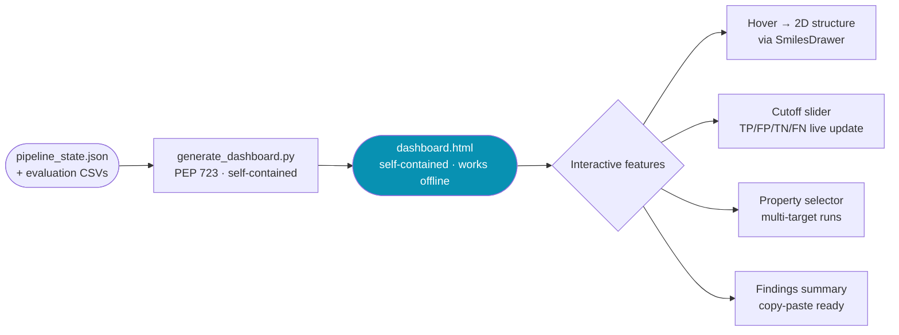

# MolAgent Light

<div align="center">

[](https://github.com/openanalytics/MolAgent)
[](https://python.org)
[](https://onnx.ai)
[](#onnx-encoder)
[](LICENSE)

*Expert-level molecular property prediction through natural language — powered by ONNX, no PyTorch required*

[Installation](#installation) • [How It Works](#how-it-works) • [Skills](#skills) • [Presets](#computational-load-presets) • [Citation](#citation)

</div>

---

## Overview

MolAgent Light is a [Claude Code](https://claude.ai/code) plugin for automated molecular property prediction (QSAR/ADMET). Describe what you want in plain English — the plugin plans, executes, and visualizes the full pipeline for you.

```text
> Train a model on my_molecules.csv with target property solubility
```

That's it. The plugin detects your dataset, configures a sensible plan, asks one confirmation question, and runs the entire pipeline — all tracked as visible Claude Code tasks.

### Why "Light"?

The pretrained molecular encoder is exported to **ONNX format**. This means:

- **No PyTorch** in the runtime dependencies — inference is pure ONNX Runtime
- **~10 MB** total encoder weight — small enough to bundle directly with the plugin
- **Platform portable** — runs anywhere ONNX Runtime runs: Linux, macOS, Windows, cloud, CI
- **Fast cold start** — no PyTorch import overhead, no CUDA initialization

This is a lightweight version of [MolAgent](https://github.com/openanalytics/MolAgent) without MCP server dependencies, designed specifically for Claude Code.

---

## How It Works

### End-to-End Pipeline



### Claude Code Task Management

Every pipeline run creates a live task list in your Claude Code session. You see exactly what is running, what completed, and what is next — no black-box scripts.

```mermaid
gantt
    title Pipeline Execution — Task View
    dateFormat X
    axisFormat Step %s

    section Preparation
    Detect dataset           :done,    s0, 0, 1
    Auto-configure plan      :done,    s1, 1, 2

    section Execution
    Prepare molecular data   :active,  s2, 2, 3
    Split into train/test    :         s3, 3, 4
    Train ensemble model     :         s4, 4, 5
    Evaluate model           :         s5, 5, 6
    Review results           :crit,    s6, 6, 7
    Refit for deployment     :         s7, 7, 8
    Generate model card      :         s8, 8, 9
```



Steps 2–5 and 7 are dispatched as parallel-capable **subagents** — the orchestrator (SKILL.md) delegates work and tracks results. Step 6 is an inline **user checkpoint** where you see metrics and decide whether to refit.

---

## ONNX Encoder

The core molecular representation comes from a pretrained **bottleneck encoder** — a neural network trained on millions of SMILES to learn compact, information-rich embeddings.



The encoder is exported once at library build time. At inference, **only ONNX Runtime is required** — no PyTorch, no CUDA, no model-loading boilerplate. The `.onnx` file is bundled directly inside the plugin at `AutoMol/automol/automol/bottleneck_encoder.onnx`.

---

## Skills

### `train-pipeline` — End-to-End Training

```text
> Train a model on my_molecules.csv with target property potency
> /train-pipeline
```



**Highlights:**

- Handles **regression**, **classification**, and mixed targets
- **Nested cross-validation** with HyperOpt Bayesian search
- **Stacking ensembles** — base learners combined with a meta-model
- **Multi-property merging** — shared ONNX encoder across all targets, eliminating duplication
- Resumes interrupted pipelines from the last completed step

---

### `predict` — Inference

```text
> Predict solubility for new_molecules.csv
> /predict
```

Auto-discovers trained models from the registry. Accepts CSV files or individual SMILES strings. Supports merged multi-property models (single call predicts all targets).



Output files are **timestamped** (`tpsa_predictions_20260309_150000.csv`) so repeated runs never overwrite each other.

---

### `visualize` — Interactive Dashboard

```text
> Visualize the results from my last training run
> /visualize
```

Generates a **self-contained HTML file** with Plotly.js charts and SmilesDrawer molecular hover tooltips. No server needed — works offline after first load.

**Regression plots:** scatter with MAE bands · moving average error · residuals · error histogram · error bar plot · hit enrichment curve · threshold sweep

**Classification plots:** confusion matrix · ROC curves · precision-recall curves · F1 threshold tuning · calibration diagram · probability bar plot



---

## Installation

### Prerequisites

- Python 3.10+ (earlier system Python is fine — `uv` will use a newer version in the venv)
- [uv](https://docs.astral.sh/uv/) package manager

```bash
git clone https://github.com/JorisTavernier/MolAgentLight.git
cd MolAgentLight
```

### Install the Plugin

In Claude Code:

```text
/plugin marketplace add ./MolAgent-Marketplace
/plugin install MolAgentLight@molagent-marketplace
```

> **Note:** After installing, restart Claude Code once so the SessionStart hook creates the virtual environment and installs AutoMol. Then restart a **second** time — this injects `$MOLAGENT_PLUGIN_ROOT` into all Bash calls (including subagents) via `.claude/settings.local.json`.

---

## Computational Load Presets

| Level    | Time        | Description |
| -------- | ----------- | ----------- |
| `free` | 0–2 min | Single LightGBM — fast signal check, no ensemble |
| `cheap` | 2–10 min | Light ensemble, basic search — quick prototyping |
| `moderate` | 10–360 min | Light ensemble, tree methods, randomized search — good balance |
| `expensive` | 1–48 hrs | Stacking ensemble, Bayesian HyperOpt — maximum accuracy |

Detection auto-recommends a preset based on dataset size. You confirm (or change) with one question.

---

## Repository Layout

```text
MolAgentLight/
├── MolAgent-Marketplace/
│   ├── .claude-plugin/
│   │   └── marketplace.json          # Marketplace catalog
│   └── MolAgentLight/                # Plugin root
│       ├── .claude-plugin/
│       │   └── plugin.json           # Plugin manifest
│       ├── AutoMol/automol/          # Bundled ML library
│       │   └── automol/
│       │       ├── bottleneck_encoder.onnx      # Pretrained encoder
│       │       ├── stacking.py                  # Ensemble models
│       │       ├── feature_generators.py        # ONNX + ECFP + RDKit
│       │       └── model_search.py              # Nested CV + HyperOpt
│       ├── hooks/
│       │   └── setup-automol-env.sh  # SessionStart: venv + MOLAGENT_PLUGIN_ROOT
│       └── skills/
│           ├── train-pipeline/       # 8-step training orchestrator
│           │   ├── SKILL.md
│           │   ├── scripts/          # Python Click CLIs
│           │   └── steps/            # Step-by-step subagent guides
│           ├── predict/              # Inference skill
│           │   ├── SKILL.md
│           │   └── scripts/predict.py
│           └── visualize/            # Dashboard skill
│               ├── SKILL.md
│               └── scripts/generate_dashboard.py  # PEP 723
└── MolagentFiles/                    # Pipeline outputs (gitignored)
    └── model_registry.json           # Global model index (versioned)
```

---

## Troubleshooting

### Custom Virtual Environment

By default the plugin creates `.venv` in the project root. Override with:

```bash
export AUTOMOL_VENV=/path/to/your/venv
```

### Windows: `uv` or `python` Not Found

Add the Python Scripts directory to your PATH:

```bash
export PATH="$HOME/AppData/Roaming/Python/PythonXX/Scripts:$PATH"
```

### Windows: Corporate Proxy
When behind a proxy, let uv use the native certificates:
```bash
export UV_NATIVE_TLS=true
```

---

## Citation

### MolAgent: Biomolecular Property Estimation in the Agentic Era

Jose Carlos Gómez-Tamayo\*, Joris Tavernier\*\*, Roy Aerts\*\*\*, Natalia Dyubankova\*, Dries Van Rompaey\*, Sairam Menon\*, Marvin Steijaert\*\*, Jörg Wegner\*, Hugo Ceulemans\*, Gary Tresadern\*, Hans De Winter\*\*\*, Mazen Ahmad\*

> \*Johnson & Johnson · \*\*Open Analytics NV · \*\*\*University of Antwerp

```bibtex
@article{molagent2025,
  author  = {Gómez-Tamayo, Jose Carlos and Tavernier, Joris and Aerts, Roy and
             Dyubankova, Natalia and Van Rompaey, Dries and Menon, Sairam and
             Steijaert, Marvin and Wegner, Jörg Kurt and Ceulemans, Hugo and
             Tresadern, Gary and De Winter, Hans and Ahmad, Mazen},
  title   = {MolAgent: Biomolecular Property Estimation in the Agentic Era},
  journal = {Journal of Chemical Information and Modeling},
  volume  = {65},
  number  = {20},
  pages   = {10808--10818},
  year    = {2025},
  doi     = {10.1021/acs.jcim.5c01938},
  note    = {PMID: 41099298},
}
```

---

## References

1. **[AutoMol](https://github.com/openanalytics/AutoMol)** — Core ML pipeline for QSAR/drug discovery
2. **[ONNX Runtime](https://onnxruntime.ai/)** — Cross-platform ML inference engine
3. **[scikit-learn](https://scikit-learn.org/)** — Pedregosa et al. (2011). JMLR, 12, 2825–2830.
4. **[molfeat](https://molfeat.datamol.io/)** — Noutahi et al. (2023). Zenodo. [doi:10.5281/zenodo.8373019](https://doi.org/10.5281/zenodo.8373019)
5. **[RDKit](https://www.rdkit.org/)** — Open-source cheminformatics
6. **[Plotly.js](https://plotly.com/javascript/)** — Interactive charting library
7. **[SmilesDrawer](https://github.com/reymond-group/smilesDrawer)** — Probst & Reymond (2018). JCIM, 58(1), 1–7.

---

## License

[GPL-3.0](LICENSE)
