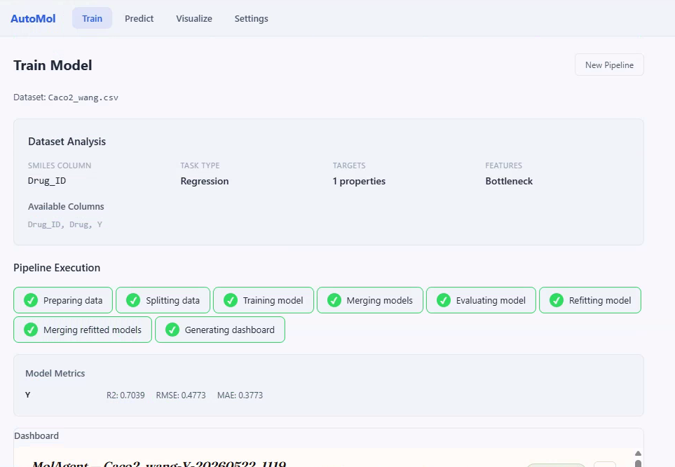
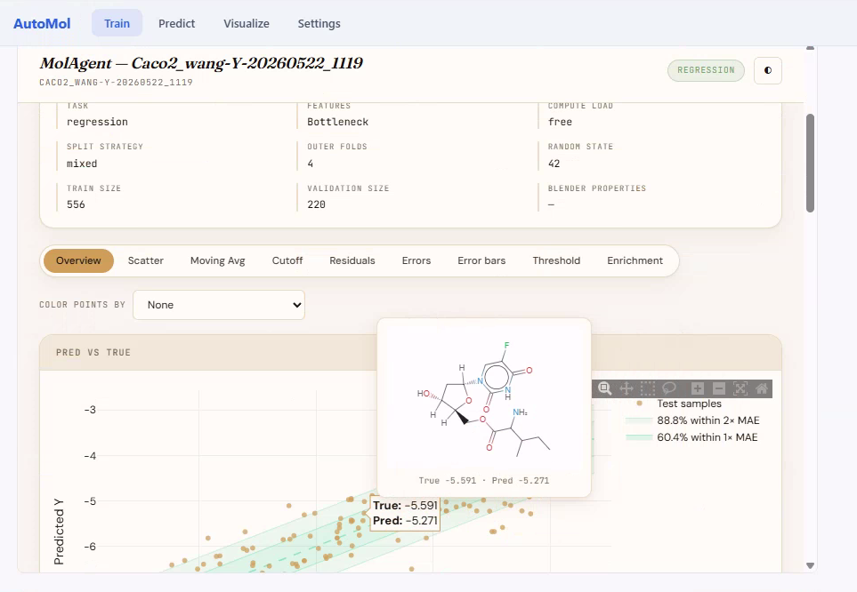

# MolAgent — Automated Molecular Property Prediction

MolAgent is an end-to-end ML pipeline for molecular property prediction from SMILES data. It uses ensemble stacking models with pretrained molecular encoders and ships as a **Claude Code plugin**, an **MCP server**, and a **browser-based web app**.

### Update June 12, 2026

Previously MolAgent only had Claude Code skills (LLM-driven orchestration). This version adds a deterministic pipeline layer and a full web interface:

- **MCP server** — 13-tool API that runs the pipeline deterministically (no LLM in the loop). Supports stdio (Claude Code plugin) and streamable-http (remote deployment) transports.
- **Multi-user authentication** — Bearer token auth with per-user model/dataset isolation, admin token management, user creation/revocation/rotation.
- **Web app** — SvelteKit 5 + FastAPI browser UI connecting to the MCP server (local or remote) with real-time step-by-step progress tracking.
- **Data registry** — Upload datasets (base64), per-user isolation, `dataset_id` references across training and prediction.
- **Model registry** — Auto-registered on training completion, `last_used` tracking, download via base64, model merging across properties.
- **Interactive dashboards** — Plotly.js evaluation dashboards with molecular structure hover tooltips, generated as self-contained HTML.
- **Admin cleanup** — `purge_stale` removes unused models/datasets by age; `purge_orphans` removes leftover run folders from failed training.
- **Determinism mode** — `MOLAGENT_DETERMINISTIC=true` seeds all RNGs and forces serial CV for reproducible results.

---

## What's inside

```
molagentlight/
├── MolAgent-Marketplace/
│   ├── .claude-plugin/marketplace.json     # Claude Code marketplace catalog
│   └── MolAgentLight/                      # The plugin (skills + MCP + web app)
│       ├── .claude-plugin/plugin.json      # Plugin manifest
│       ├── AutoMol/automol/                # Bundled AutoMol ML library
│       ├── skills/
│       │   ├── train-pipeline/             # End-to-end training skill
│       │   ├── predict/                    # Inference skill
│       │   └── visualize/                  # Interactive dashboard skill
│       ├── mcp/
│       │   ├── server.py                   # MCP server (stdio + streamable-http)
│       │   ├── admin_cli.py                # User/admin management CLI
│       │   ├── _pipeline.py                # Pipeline orchestrator
│       │   ├── _auth.py                    # Token authentication
│       │   ├── _data_registry.py           # Dataset registry + last_used tracking
│       │   └── MCP_SERVER.md               # Full MCP API reference
│       ├── app/
│       │   ├── start.sh                    # One-command app launcher
│       │   ├── backend/                    # FastAPI HTTP → MCP bridge
│       │   ├── frontend/                   # SvelteKit 5 + Tailwind CSS 4
│       │   └── README.md                   # Web app reference
│       ├── hooks/setup-automol-env.sh      # SessionStart hook (venv setup)
│       ├── commands/automol-status.md      # /automol-status slash command
│       └── playgrounds/                    # Nexus dashboard playground template
└── MolagentFiles/                          # All pipeline outputs (gitignored except registry)
    ├── model_registry.json                 # Model index (with last_used tracking)
    ├── data_registry.json                  # Dataset index (per-user, with last_used)
    ├── uploads/{owner_id}/                 # Per-user uploaded datasets
    └── {run_id}/                           # Per-run outputs (models, CSVs, dashboard)
```

---

## Prerequisites

- Python 3.10+
- [uv](https://github.com/astral-sh/uv) — `pip install uv`
- Node.js 18+ (for the web app frontend)
- Claude Code (for the plugin skills)

**Windows / corporate proxy:** if `uv` isn't found after install, add it to PATH:
```bash
export PATH="$HOME/AppData/Roaming/Python/PythonXX/Scripts:$PATH"
```
If behind a firewall:
```bash
export UV_NATIVE_TLS=true
```

---

## Installation

### As a Claude Code plugin (recommended)

```bash
/plugin marketplace add ./MolAgent-Marketplace
/plugin install MolAgentLight@molagent-marketplace
```

Restart Claude Code after installing — the SessionStart hook will auto-create the `.venv` and install AutoMol.

### Manual (library only)

```bash
pip install -e MolAgent-Marketplace/MolAgentLight/AutoMol/automol/
```

### Manual (venv + MCP/web app dependencies)

```bash
cd MolAgent-Marketplace/MolAgentLight
uv venv .venv --python 3.12
source .venv/bin/activate
uv pip install -e AutoMol/automol/
uv pip install "fastmcp[tasks]" pandas pydantic
cd app/frontend && npm install
```
Activating the environment can be different on Windows.

---

## Usage — Claude Code skills

After installing the plugin, three natural-language skills are available:

| Skill | Trigger phrase | What it does |
|-------|---------------|--------------|
| `train-pipeline` | "train a model for my_data.csv" | Detect dataset → prepare → split → train → evaluate → refit → dashboard |
| `predict` | "predict using the Caco2 model" | Auto-discover models from registry, run inference on SMILES |
| `visualize` | "visualize the Caco2 run" | Generate an interactive Plotly dashboard from evaluation results |

Example:
```
Train a model for /path/to/molecules.csv using cheap computational load
```

### Computational load presets

| Level | Time | Method |
|-------|------|--------|
| `free` | 0–2 min | Single method with hyperparameter search |
| `cheap` | 2–10 min | Light hyperparameter search |
| `moderate` | 10–360 min | Stacking ensemble |
| `expensive` | 1–48 hr | Full stacking + HyperOpt |

---

## Usage — Web App

The web app provides a browser UI with the same pipeline functionality.



*Training pipeline — dataset analysis, step-by-step progress, and model metrics.*



*Interactive Plotly dashboard — predicted vs true scatter with molecular structure hover tooltips.*

### Start the app

```bash
cd MolAgent-Marketplace/MolAgentLight/app
./start.sh
```

- Frontend: http://localhost:5173
- Backend API: http://localhost:8000/api/health

`start.sh` installs frontend dependencies automatically on first run.

### Manual start

```bash
cd MolAgent-Marketplace/MolAgentLight/app

# Backend (terminal 1)
uv run --with fastapi --with uvicorn --with python-multipart --with pydantic-settings --with "fastmcp[tasks]" --with pandas \
  uvicorn backend.main:app --host 127.0.0.1 --port 8000

# Frontend (terminal 2)
cd frontend && npm run dev
```

### Remote MCP mode

To connect the web app to a remote MCP server instead of spawning a local one, configure it in **Settings → Remote** in the UI, or set environment variables before starting the backend:

```bash
MCP_SERVER_URL=http://127.0.0.1:8001/mcp \
MCP_AUTH_TOKEN=<your_token> \
uv run ... uvicorn backend.main:app --port 8000
```

---

## Usage — MCP Server (standalone / remote)

The MCP server exposes 13 tools callable from any MCP client.

### Start (local stdio — used automatically by Claude Code plugin)

No manual start needed; Claude Code spawns it via the plugin manifest.

### Start (remote HTTP mode)

```bash
cd MolAgent-Marketplace/MolAgentLight
MOLAGENT_OUTPUT_ROOT=/absolute/path/to/output \
MOLAGENT_AUTH_REQUIRED=true \
uv run mcp/server.py --transport streamable-http --host 127.0.0.1 --port 8001
```

The **admin token** is auto-generated on first run, printed to stderr, and written to `MolagentFiles/admin_token.txt` (mode `0600`). Copy it and delete the file. Tokens are stored as SHA-256 hashes in `MolagentFiles/auth_tokens.json` — the plaintext cannot be recovered from there. If lost, delete `auth_tokens.json` and restart to regenerate.

### Manage users

```bash
# Create a user and get their token
uv run mcp/admin_cli.py --url http://127.0.0.1:8001/mcp --token <ADMIN_TOKEN> create-user alice

# List all users
uv run mcp/admin_cli.py --url http://127.0.0.1:8001/mcp --token <ADMIN_TOKEN> list-users

# Revoke a user by owner_id (from list-users)
uv run mcp/admin_cli.py --url http://127.0.0.1:8001/mcp --token <ADMIN_TOKEN> revoke <OWNER_ID>

# Rotate (re-issue) a user's token — old token stops working, models/datasets stay
uv run mcp/admin_cli.py --url http://127.0.0.1:8001/mcp --token <ADMIN_TOKEN> rotate <OWNER_ID>

# Purge stale models/datasets (dry-run — shows what would be deleted)
uv run mcp/admin_cli.py --url http://127.0.0.1:8001/mcp --token <ADMIN_TOKEN> purge-stale --days 30

# Purge stale models/datasets (force — actually deletes)
uv run mcp/admin_cli.py --url http://127.0.0.1:8001/mcp --token <ADMIN_TOKEN> purge-stale --days 30 --force

# Purge orphaned run folders from failed training (dry-run)
uv run mcp/admin_cli.py --url http://127.0.0.1:8001/mcp --token <ADMIN_TOKEN> purge-orphans --days 7

# Purge orphaned run folders (force — actually deletes)
uv run mcp/admin_cli.py --url http://127.0.0.1:8001/mcp --token <ADMIN_TOKEN> purge-orphans --days 7 --force
```

### Test the server

```bash
# List available models (replace with a real user token)
curl -X POST http://127.0.0.1:8001/mcp \
  -H "Authorization: Bearer <TOKEN>" \
  -H "Content-Type: application/json" \
  -d '{"jsonrpc":"2.0","method":"tools/call","params":{"name":"list_models","arguments":{}},"id":1}'
```

### Available MCP tools

| Tool | Description |
|------|-------------|
| `list_options` | Discover available features, estimators, configs |
| `start_training_session` | Auto-detect dataset config, returns `session_id`. Accepts `csv_file` or `dataset_id` |
| `answer_training_question` | Apply overrides or confirm config |
| `train_and_visualize` | Run full pipeline from config dict |
| `list_models` | List models in the registry |
| `predict` | Run inference on SMILES. Accepts `smiles_file` as path or `dataset_id` |
| `merge_models` | Merge per-property models into one multi-property file |
| `delete_model` | Remove a model from the registry |
| `download_model` | Download a model's binary data (base64) by registry ID |
| `upload_dataset` | Upload CSV (base64) to per-user data registry |
| `list_datasets` | List datasets owned by the caller |
| `delete_dataset` | Remove a dataset from the registry |
| `admin_manage` | Admin: create/list/revoke/rotate users, purge stale artifacts + orphaned folders |

See `mcp/MCP_SERVER.md` for the full API reference.

---

## Pipeline outputs

Each run produces a self-contained folder:

```
MolagentFiles/{dataset}-{properties}-{YYYYMMDD_HHMM}/
├── automol_prepared_*.csv          # Standardized dataset
├── automol_split_*.csv             # Train/test split
├── {prop}_stackingregmodel.pt      # Trained model
├── {prop}_refitted_stackingregmodel.pt  # Refitted on full data
├── {prop}_evaluation_predictions.csv   # Eval predictions
├── pipeline_state.json             # Full run state
└── dashboard.html                  # Interactive evaluation dashboard
```

The global `MolagentFiles/model_registry.json` indexes all runs and is the source of truth for `list_models` and `predict`. Each entry tracks `last_used` — updated automatically on every prediction or training session.

`MolagentFiles/data_registry.json` indexes uploaded datasets with per-user ownership, `last_used` tracking, and column/row metadata.

---

## Key environment variables

| Variable | Purpose | Default |
|----------|---------|---------|
| `MOLAGENT_OUTPUT_ROOT` | Pipeline output directory | `./MolagentFiles` |
| `AUTOMOL_VENV` | Virtual environment path | `MolAgentLight/.venv` |
| `MOLAGENT_AUTH_REQUIRED` | Enable token auth on MCP server | off |
| `MOLAGENT_DETERMINISTIC` | Seed RNGs, force serial CV | off |
| `PHARMAOS_MOLAGENT_ROOT` | Nexus per-project output root (overrides `MOLAGENT_OUTPUT_ROOT`) | — |
| `MCP_TIMEOUT` | Max time (ms) for MCP server to start/connect | `120000` |
| `MCP_TOOL_TIMEOUT` | Max time (ms) a single MCP tool call can run | `300000` |

For long training runs, set these in `~/.claude/settings.json` under `"env"`:

```json
{
  "env": {
    "MCP_TIMEOUT": "1800000",
    "MCP_TOOL_TIMEOUT": "172800000"
  }
}
```

`MCP_TIMEOUT=1800000` (30 min) covers slow first-time `uv` dependency resolution. `MCP_TOOL_TIMEOUT=172800000` (48 hr) covers `expensive` computational load training.

Full contract in `MolAgent-Marketplace/MolAgentLight/CLAUDE.md`.
